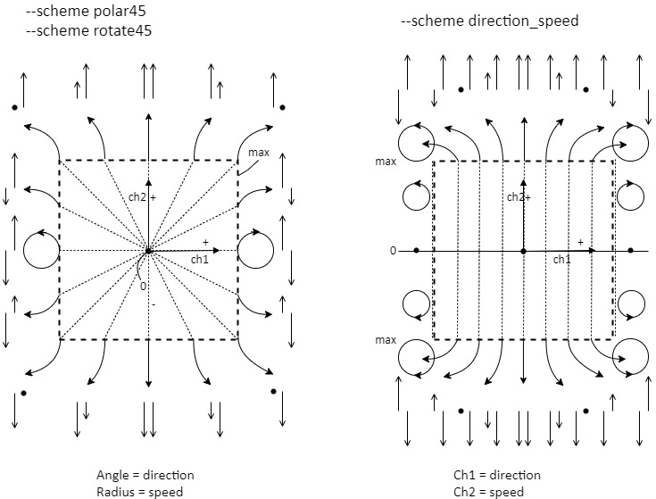
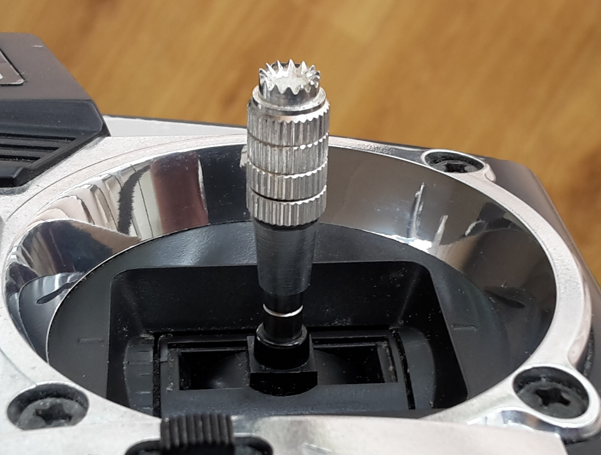

# One stick caterpillar

Mixing scheme for two channels of a radio control (RC) transmitter, to be able to control the left track and the rigth track of a caterpillar car using one stick.

* one_stick_caterpillar.py : try different onestick mixing schemes in Python (this also requires the Python modules from the desp_tools repository)
* one_stick_iir.py : first order IIR filter in Python
* onestick.h/cpp : onestick mixing schemes and useful RC channel control functions in C for Arduino
* one_stick_caterpillar.ino : Sketch for Arduino Nano to measure PWM pulses from RC receiver, condition and mix RC channels, and to output PWM pulses
  

